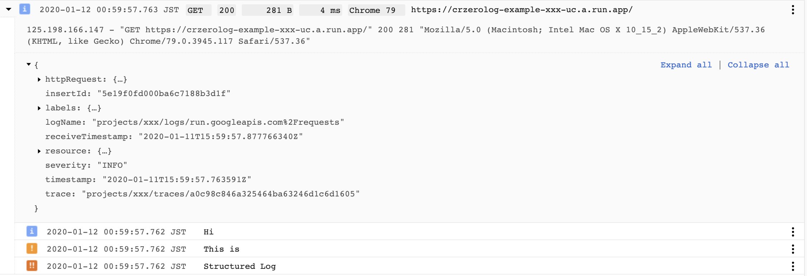
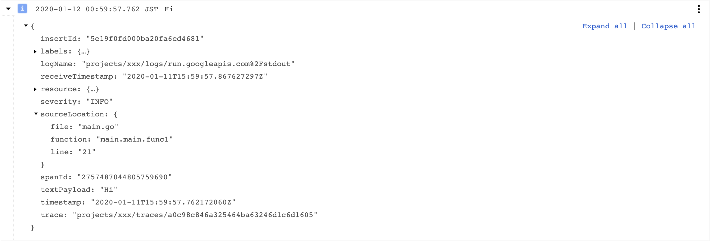
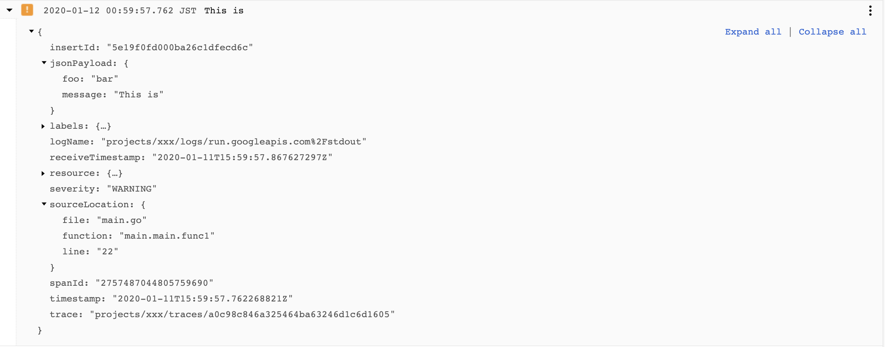
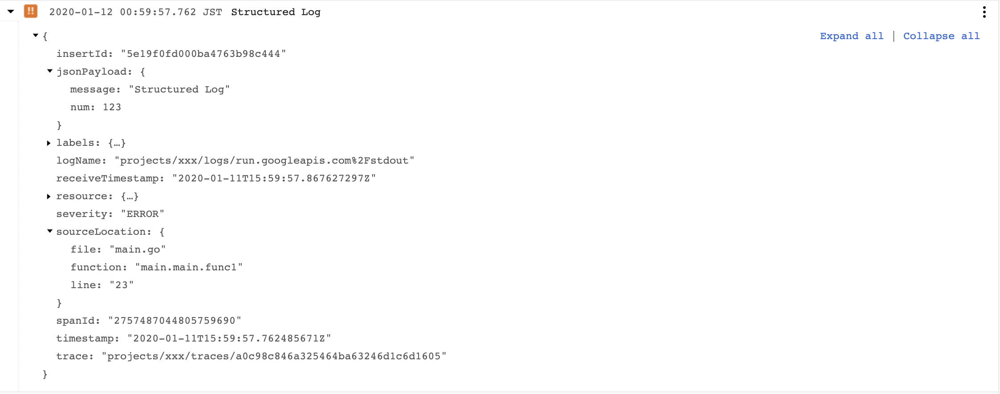

crzerolog
===
[](https://godoc.org/github.com/yfuruyama/crzerolog) [](https://circleci.com/gh/yfuruyama/crzerolog)

A [zerolog](https://github.com/rs/zerolog)-based logging library for Cloud Run.



## Features
- Auto format Cloud Logging fields such as time, severity, trace, sourceLocation
- Groups application logs with the request log
- Supports gRPC application on Cloud Run
- Supports all of [rs/zerolog](https://github.com/rs/zerolog) APIs for structured logging

## Installation

```
go get -u github.com/yfuruyama/crzerolog
```

## Example for HTTP application

You just need to use `crzerolog.InjectLogger` to set up logging. 

```go
package main

import (
	"fmt"
	"net/http"
	"os"

	"github.com/rs/zerolog"
	"github.com/rs/zerolog/log"
	"github.com/yfuruyama/crzerolog"
)

func main() {
	rootLogger := zerolog.New(os.Stdout)
	middleware := crzerolog.InjectLogger(&rootLogger)

	http.Handle("/", middleware(http.HandlerFunc(func(w http.ResponseWriter, r *http.Request) {
		logger := log.Ctx(r.Context())

		logger.Info().Msg("Hi")
		logger.Warn().Str("foo", "bar").Msg("This is")
		logger.Error().Int("num", 123).Msg("Structured Log")

		fmt.Fprintf(w, "Hello\n")
	})))

	port := "8080"
	if p := os.Getenv("PORT"); p != "" {
		port = p
	}
	log.Printf("Server listening on port %q", port)
	log.Fatal().Msg(http.ListenAndServe(":"+port, nil).Error())
}
```

After running above code on your Cloud Run service, you can find following logs in Cloud Logging.

### Request Log
The request log is automatically written by Cloud Run. The log viewer shows correlated container logs in the same view.


### Container Logs
Container logs are written by this library. You can find that some Cloud Logging fields, such as `severity`, `sourceLocation`, `timestamp`, and `trace` are automatically set.



If you add additional JSON fields to the log with [zerolog](https://godoc.org/github.com/rs/zerolog) APIs, those fields are contained in `jsonPayload` of the log.





## Example for gRPC application

This library also supports gRPC application on Cloud Run.

You just need to use `crzerolog.InjectLoggerInterceptor` to set up logging. 

```go
package main

import (
	"context"
	"github.com/yfuruyama/crzerolog"
	"net"
	"os"

	"github.com/rs/zerolog"
	"github.com/rs/zerolog/log"
	"google.golang.org/grpc"

	pb "github.com/yfuruyama/crzerolog/example/grpc/proto"
)

type server struct{}

func (s *server) Echo(ctx context.Context, r *pb.EchoRequest) (*pb.EchoReply, error) {
	logger := log.Ctx(ctx)

	logger.Info().Msg("Hi")
	logger.Warn().Str("foo", "bar").Msg("This is")
	logger.Error().Int("num", 123).Msg("Structured Log")

	return &pb.EchoReply{Msg: r.GetMsg() + "!"}, nil
}

func main() {
	port := "8080"
	if fromEnv := os.Getenv("PORT"); fromEnv != "" {
		port = fromEnv
	}

	l, err := net.Listen("tcp", ":"+port)
	if err != nil {
		log.Fatal().Msgf("Failed to listen: %v", err)
	}

	rootLogger := zerolog.New(os.Stdout)
	s := grpc.NewServer(
		grpc.UnaryInterceptor(crzerolog.InjectLoggerInterceptor(&rootLogger)),
	)
	pb.RegisterHelloServer(s, &server{})
	if err := s.Serve(l); err != nil {
		log.Fatal().Msgf("Failed to serve: %v", err)
	}
}
```

## Level mapping
This library automatically maps [zerolog level](https://godoc.org/github.com/rs/zerolog#Level) to [Cloud Logging severity](https://cloud.google.com/logging/docs/reference/v2/rest/v2/LogEntry#LogSeverity).

Mapping is as follows.

| zerolog level | Cloud Logging severity |
| --- | --- |
| NoLevel | DEFAULT |
| TraceLevel | DEFAULT |
| DebugLevel | DEBUG |
| InfoLevel | INFO |
| WarnLevel | WARNING |
| ErrorLevel | ERROR |
| FatalLevel | CRITICAL |
| PanicLevel | ALERT |

## Supported Platform
- Cloud Run (fully managed) for HTTP and gRPC
- Google App Engine (2nd-Generation) for HTTP

## License
[Apache 2.0](LICENSE).

## Disclaimer
This is not an official Google product.
